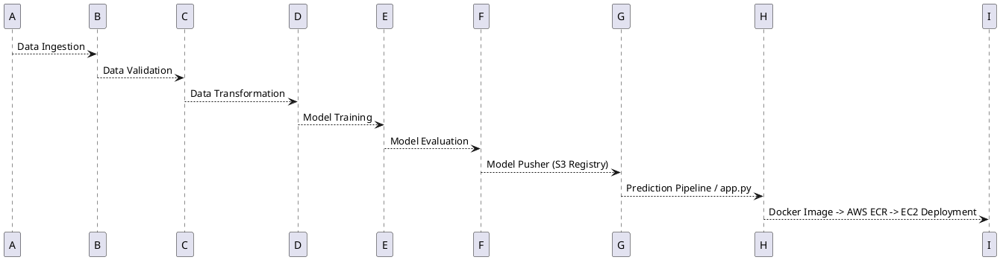

# 🚀 MLOps Project – Fintech Data Pipeline

> **An end-to-end MLOps pipeline** Welcome to this MLOps project, designed to demonstrate a robust pipeline for managing fintech payment data. This project aims to showcasing the various tools, techniques, services, and features that go into building and deploying a machine learning pipeline for real-world data management. Follow along to learn about project setup, data processing, model deployment, and CI/CD automation! 

---

## ✨ Features

* 📦 **Project Template Automation** with `template.py`
* ⚙️ **Local Package Management** via `setup.py` & `pyproject.toml`
* 🐍 **Isolated Environments** using `venv`
* 🍃 **Data Storage** on **MongoDB Atlas** (cloud hosted NoSQL DB)
* 📑 **Structured Logging & Exception Handling**
* 📊 **EDA & Feature Engineering** notebooks
* 🔄 **Data Ingestion → Validation → Transformation → Training** workflow
* ☁️ **AWS Integration**: S3 for model registry, ECR for images, EC2 for hosting
* 🐳 **Containerization** with Docker
* 🔐 **GitHub Secrets** for AWS credentials
* 🤖 **CI/CD with GitHub Actions** + **self-hosted runners on EC2**
* 🌐 **Deployed Web App** (Flask/FastAPI) running on **port 5000**

---

## 🛠️ Tech Stack

| Layer                | Tools & Services                                               |
| -------------------- | -------------------------------------------------------------- |
| **Programming**      | Python 3.13                                                    |
| **Version Control**  | Git, GitHub                                                    |
| **Environment Mgmt** | venv                                                           |
| **Database**         | MongoDB Atlas                                                  |
| **Orchestration**    | Modular ML pipeline (constants, config, components, artifacts) |
| **Cloud**            | AWS S3, EC2, IAM, ECR                                          |
| **Containerization** | Docker                                                         |
| **CI/CD**            | GitHub Actions, self-hosted runners                            |
| **Deployment**       | Flask/FastAPI app on EC2                                       |

---

## 📂 Project Workflow



### 2️⃣ Create Virtual Environment

```bash
# Get Python path
python -c "import sys; print(sys.executable)"

# Create & activate venv
python -m venv insurance
.\insurance\Scripts\Activate

# Install requirements
pip install -r requirements.txt
```

### 3️⃣ Setup MongoDB Atlas

* Create **M0 cluster**, set DB user + password
* Add IP: `0.0.0.0/0`
* Get **connection string** (Python driver, v3.6+)
* Save as environment variable `MONGODB_URL`

### 4️⃣ Run Notebooks

* `notebook/mongoDB_demo.ipynb` → push sample data to MongoDB
* `EDA & Feature Engineering` notebooks

### 5️⃣ Data Pipeline Components

* **Data Ingestion** → pull data from MongoDB
* **Data Validation** → validate schema via `config/schema.yaml`
* **Data Transformation** → feature engineering, preprocessing
* **Model Trainer** → ML model training and persistence

### 6️⃣ AWS Setup

* IAM user (`AdministratorAccess`)
* Configure AWS credentials:

  ```bash
  export AWS_ACCESS_KEY_ID=xxx
  export AWS_SECRET_ACCESS_KEY=yyy
  ```
* **S3** → model registry
* **ECR** → store Docker image
* **EC2** → deploy app

### 7️⃣ CI/CD Pipeline

* Dockerfile + `.github/workflows/aws.yaml`
* GitHub Actions pushes Docker image → ECR
* Self-hosted runner on EC2 pulls + runs container

### 8️⃣ Deployment

* Expose port `5000` in EC2 security group
* Access app at:

  ```
  http://<EC2-Public-IP>:5000
  ```

---

## 📈 Highlights

✅ **Demonstrates full MLOps lifecycle** – data → ML → deployment
✅ **Cloud-native** with AWS (IAM, S3, ECR, EC2)
✅ **Production-ready CI/CD** with GitHub Actions & Docker
✅ **Secure credentials** via GitHub Secrets
✅ **Scalable architecture** with modular pipeline design
✅ **Hands-on with both ML & DevOps** aspects

---

## 🎯 Project Workflow Summary
Data Ingestion ➔ Data Validation ➔ Data Transformation
Model Training ➔ Model Evaluation ➔ Model Deployment
CI/CD Automation with GitHub Actions, Docker, AWS EC2, and ECR

---

## 💬 Connect
If you found this project helpful or have any questions, feel free to reach out!

---

This README provides a structured walkthrough of the MLOps project, showcasing the end-to-end pipeline, cloud integration, CI/CD setup, and robust data handling capabilities.
